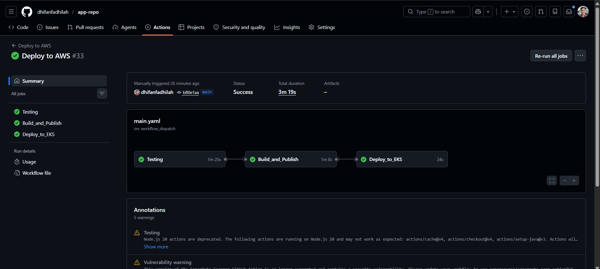
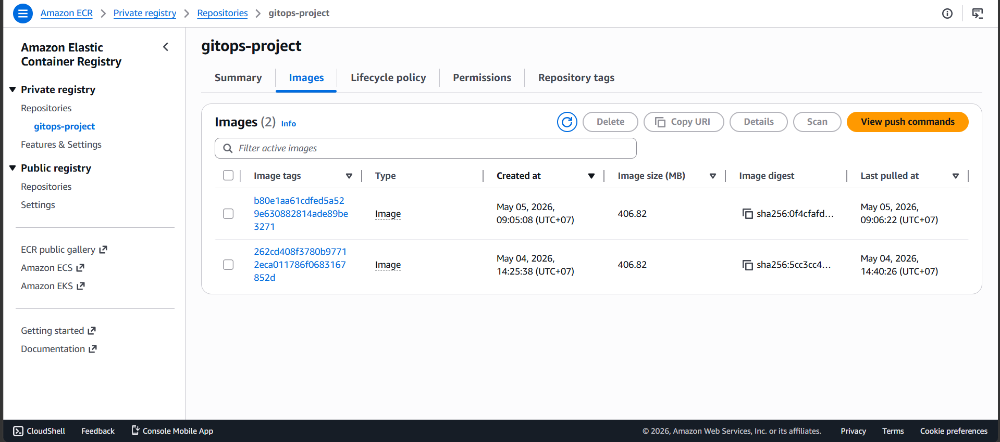
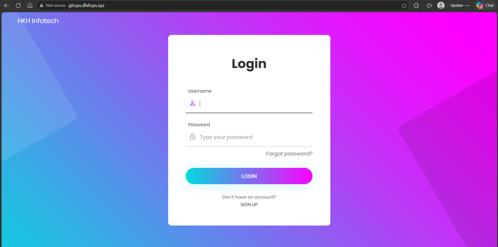
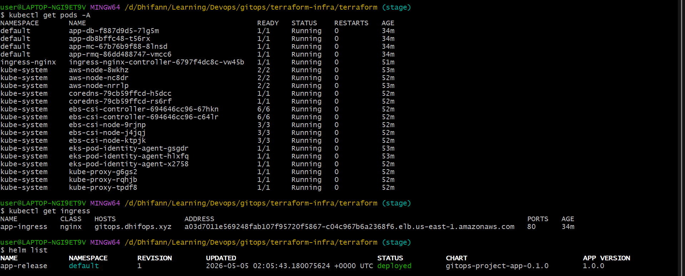

# 🚀 GitOps CI/CD: Java Microservices App Deployment

This repository houses the application source code, Docker containerization strategies, Helm charts, and the **Continuous Integration / Continuous Deployment (CI/CD)** pipeline required to securely build and deploy a Java application to Amazon EKS.

### 🔗 The Infrastructure Repository
> **Note:** This repository handles the application lifecycle. The underlying Amazon EKS cluster, VPC, and AWS IAM roles are provisioned securely via Terraform. To view the Infrastructure as Code, please visit the **[Infrastructure Repository Here](https://github.com/dhifanfadhilah/terraform-infra)**.

### ⚠️ Scope & Disclaimer
> *The Java application source code in this repository serves as a sample workload to demonstrate the deployment architecture. The primary focus of this project is strictly on the **DevOps, Cloud Infrastructure, and CI/CD lifecycle** rather than software engineering or application-level security.*

---

## 🏗️ CI/CD Pipeline Architecture

The deployment lifecycle is fully automated using **GitHub Actions**. The pipeline is broken down into three strict, dependent stages to ensure code quality and deployment safety:

### Stage 1: Testing & Code Quality
* Validates the codebase using `mvn test`.
* Enforces formatting and syntax standards via `checkstyle`.
* Integrates with **SonarQube** to perform static application security testing (SAST) and enforce a strict Quality Gate before allowing the build to proceed.

### Stage 2: Build & Publish
* Utilizes **AWS OIDC** to securely authenticate with AWS without hardcoding long-lived access keys.
* Builds the Docker image and tags it dynamically using the immutable Git Commit SHA (`${{ github.sha }}`).
* Pushes the versioned artifact to Amazon Elastic Container Registry (ECR).

### Stage 3: GitOps Deployment
* Connects to the Amazon EKS cluster built by the Infrastructure repository.
* Dynamically injects the new image tag and GitHub Secrets (database passwords) into the `values.yaml` file.
* Upgrades the application via **Helm**, maintaining zero-downtime rollouts and easy rollback capabilities.

---

## 🚀 Key Engineering Features

### 1. Dynamic Git SHA Tagging
Images are never tagged as `latest`. By tagging Docker images with the exact Git commit SHA that triggered the build, every deployment is strictly tied to a specific point in time in the version control history, allowing for instant, deterministic rollbacks.

### 2. Multi-Stage Docker Builds
The `Dockerfile` is optimized using multi-stage builds. The source code is compiled in a heavy Maven/Java build container, but only the final compiled artifact (the `.war` or `.jar` file) is copied into the lightweight Tomcat runtime image. This dramatically reduces the attack surface and image size.

### 3. Secret Management
Database credentials and RabbitMQ passwords are not stored in plaintext inside the Helm charts. They are securely stored as GitHub Secrets and injected into Kubernetes Secrets dynamically at deployment time via Helm `--set` overrides.

---

## 📸 Screenshots

### GitHub Actions Workflow

### Amazon ECR

### Application

### Kubernetes
